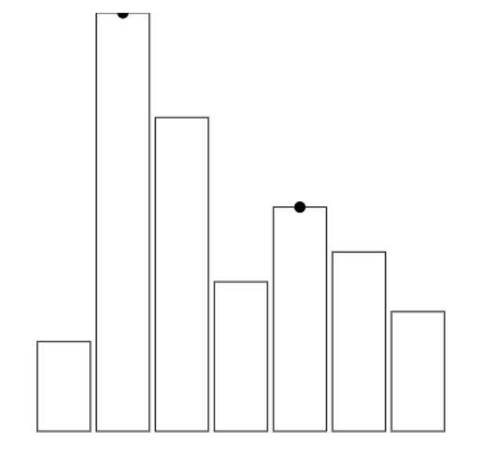

Assignment 3 - Replicating a Classic Experiment  
===
* Experiment 1 link: https://forms.gle/SzZsSXLjd8DFFFNX6
* Experiment 2 link:https://docs.google.com/forms/d/e/1FAIpQLSc5z-g1_s5byEVxiPVpLy9f_laUAA0Z-j0wfilXcFdy5ub1fw/viewform?usp=sf_link
* Experiment 3 link:https://forms.gle/gwP8EfjWpiPHx5rY7

For our experiment, we asked participants to compare **bar charts**, **pie charts**, and **tree maps**. We used Google Forms to host the experiment for the sake of practicability. We have 200 trials for each type of visualization.

Pie Chart
===
The chart below shows log errors of 20 pie charts along with the bootstraped confidence intervals.

* The first thing you might realize is that error bars are not symmetric. When data is not normally distributed, the confidence intervals might naturally be asymmetric. The bootstrap method, which is robust to non-normal distributions, can yield asymmetric confidence intervals that are a more accurate representation of the uncertainty in the estimate.

* There is a great variance between charts, for example, charts 8 (having the most accurate estimations) and 12 (having the worst estimations). You can see all pie charts in the folder. 
**Chart 8** 
  
   
  
**Chart 12** 

* The reason that leads to this can be 1) **Position**: When marked slices are adjacent to each other, it could be easier to judge. 2) **Number of data points**: When the number of data points is higher, it may be harder to judge. 3) **Difference**: When there is a significant difference, it is easier to compare.
  

Bar Chart
===
The chart below shows log errors of 20 bar charts.

There's also a huge variance between these charts, chart 7 is hving worst estimations.

**Chart 7** 

=======

* There is a great variance between charts, for example, charts 8 (having the most accurate estimations) and 12 (having the worst estimations). You can see all pie charts in the folder. \
**Chart 8** 
  
   
  
**Chart 12** 

* The reason that leads to this can be 1) **Position**: When marked slices are adjacent to each other, it could be easier to judge. 2) **Number of data points**: When the number of data points is higher, it may be harder to judge. 3) **Difference**: When there is a significant difference, it is easier to compare.
  

Tree Map
===

Technical Achievements
===
* Data is randomly generated and 2 points are randomly marked.
* Make a error plots with caculating Log error.
=======

Design Achievements
===
* We keep the visualization simple and lean.

